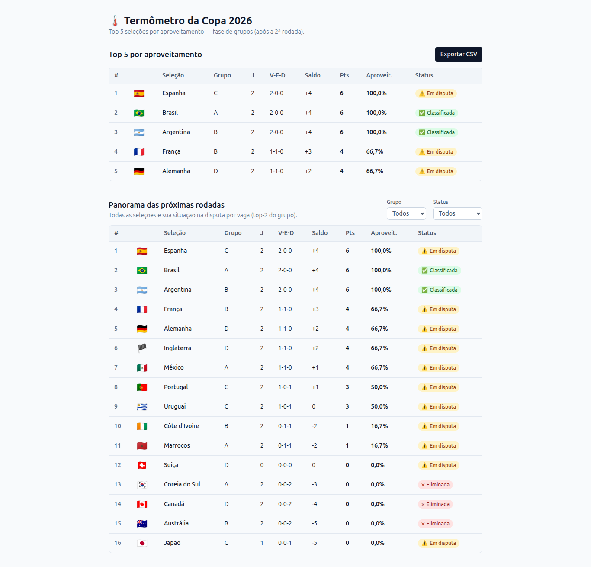
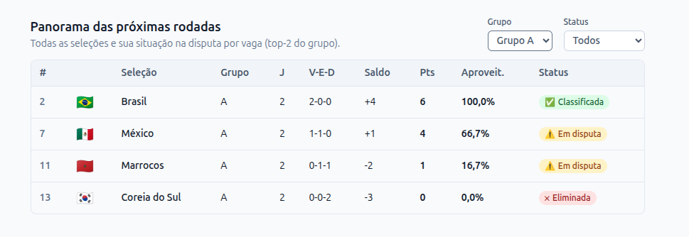
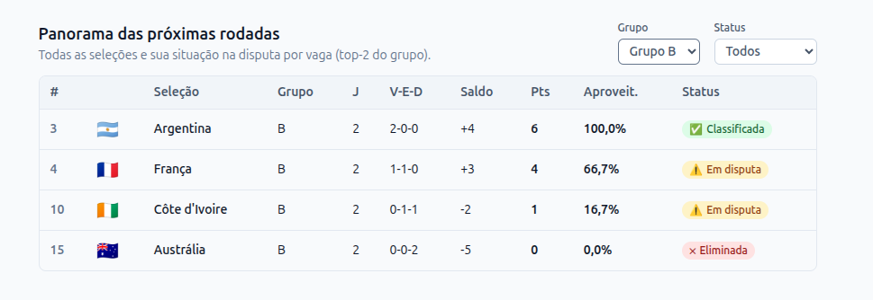
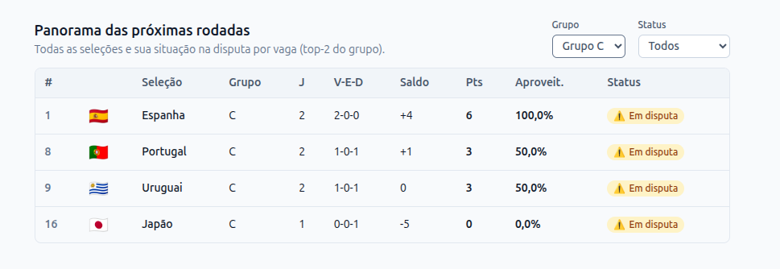
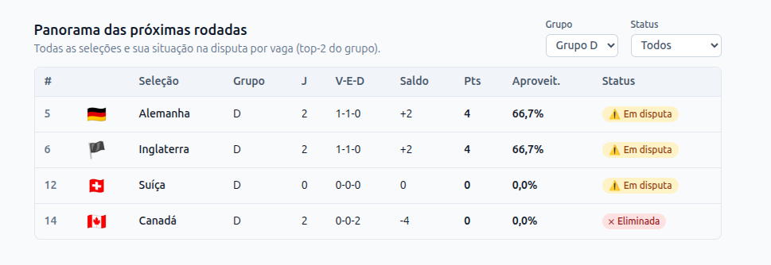
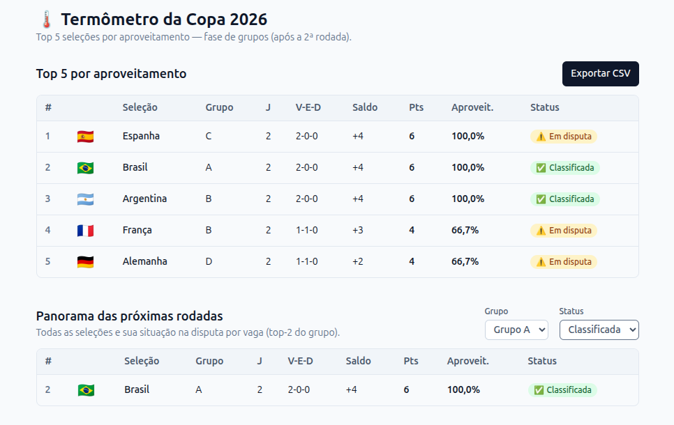
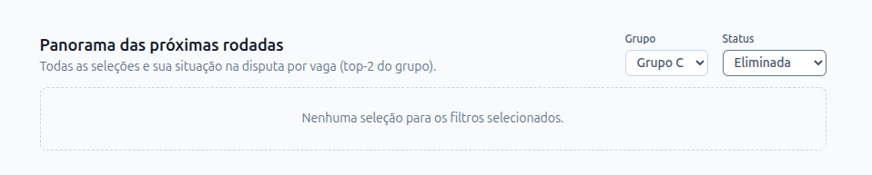
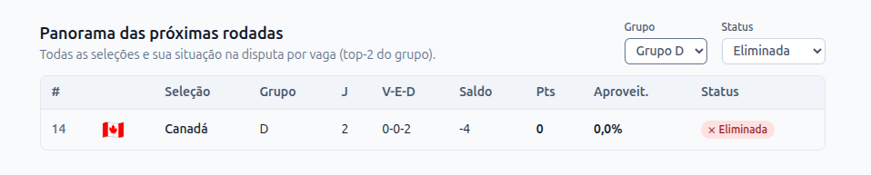

# Informações sobre os prompts

## Clique para expandir e ver as instruções de como preencher o arquivo sobre o uso de prompts e os prompts utilizados para o desafio.

<br>

<details>
  <summary><span style="font-size:2.0em; font-weight:bold;">Instruções de como preencher o arquivo sobre o uso de prompts</span></summary>

Instruções:

> Preencha este arquivo conforme for usando o Cursor. Você pode escrever
> resumido — não precisa ser perfeito. O objetivo é deixar rastreável o
> raciocínio, não escrever uma redação.
>
> Para cada prompt, escolha **um** dos formatos abaixo:
> - colar o **link de Share** do chat do Cursor (menu `⋯` → Share);
> - **ou** copiar/colar o texto do prompt.
>
> Ambos servem.

---

## Prompt 1 — [resumo de 1 linha do que você pediu]

**Por quê:** [1 frase: o que você queria conseguir]

```
[texto do prompt OU link de Share]
```

**O que veio e o que eu fiz:** [aceitei como está / editei à mão / rejeitei e
prompteei de novo / etc.]

---

## Prompt 2 — ...

**Por quê:**

```

```

**O que veio e o que eu fiz:**

---

<!-- Continue adicionando blocos para cada prompt -->

</details>

---

<br></br>

---

<details>
  <summary><span style="font-size:2.0em; font-weight:bold;">Prompts utilizados para o desafio</span></summary>


## Prompt 1 — Análise dos requisitos do desafio

**Por quê:** Entender completamente o problema antes de começar a implementação, identificando objetivos, requisitos, ambiguidades e riscos.

```text
"Estamos no meio da fase de grupos da Copa do Mundo 2026 (EUA / Canadá / México,
formato novo de 48 seleções).

Um analista esportivo quer abrir uma página e ver, num piscar de olhos, **as 5
seleções com maior aproveitamento (% de pontos conquistados sobre os possíveis)**
até agora, com bandeira, grupo, V-E-D, saldo de gols, pontos e um indicador de
status de classificação. Ele também quer **exportar a lista em CSV** para mandar
no grupo do WhatsApp da empresa.

É isso. O resto deste documento são apenas regras e detalhes para você executar."

Baseado nesse contexto o desafio pede:

"## 2. O que você vai construir

Uma única tela ("Termômetro da Copa") contendo:

1. Uma **tabela com 5 linhas** — as Top 5 seleções por aproveitamento.
2. Cada linha mostra, nesta ordem:
   - Posição (1 a 5)
   - Bandeira (emoji do dataset)
   - Seleção
   - Grupo
   - Jogos disputados
   - Vitórias / Empates / Derrotas (pode ser uma coluna `V-E-D` ou três colunas)
   - Saldo de gols (com sinal: `+4`, `-2`, `0`)
   - Pontos
   - Aproveitamento (%, 1 casa decimal — ex.: `83,3%`)
   - Status: ✅ Classificada · ⚠️ Em disputa · ❌ Eliminada
3. Um botão **"Exportar CSV"** que baixa o mesmo conteúdo, com cabeçalhos em
   português, abrindo corretamente no Excel em pt-BR.

UI simples e limpa basta. Não precisa ser bonita "de design" — precisa ser
**legível e correta**."

seguindo ainda nesse contexto: observe as regras de nogócio:

"## 3. Regras de negócio

### Aproveitamento


aproveitamento = pontos / (jogos × 3)


Expresso em % com **1 casa decimal**.

### Ordenação

Ordene por **aproveitamento desc**. Em caso de empate:
1º critério de desempate: **saldo de gols** (maior primeiro)
2º critério de desempate: **gols pró** (maior primeiro)

Se ainda assim houver empate, **você decide o critério final** — só **documente
sua escolha** no `README.md`.

### Status de classificação

Cada grupo tem **4 seleções**, classifica-se quem ficar em **1º ou 2º** do grupo
ao fim das 3 rodadas.

- ✅ **Classificada**: já garantiu top-2 do grupo matematicamente (mesmo no pior
  cenário das partidas restantes).
- ❌ **Eliminada**: não há mais cenário matemático que coloque a seleção no
  top-2 do grupo.
- ⚠️ **Em disputa**: qualquer outra situação.

> O status deve ser **calculado** a partir dos dados — não use atalhos.

### Pontuação (caso precise)

Vitória = 3 pts · Empate = 1 pt · Derrota = 0 pt.

---

## 4. Dados

Use o arquivo `dataset.json` que veio junto com este briefing como fonte de dados
mockada. Estado simulado em **24/jun/2026, após a 2ª rodada da fase de grupos**.

Você decide se serve esses dados via:
- Endpoint Express (`GET /api/copa/selecoes`),
- Arquivo estático servido pelo seu front,
- Ou import direto.

Qualquer uma das três é aceitável — só justifique brevemente no `README.md`.

---"
 

fornceça:
objetivos principal
requisitos funcionas
requisitos não funcionais
ambiguidades
possíveis riscos
critérios de sucesso

não gere código
```

**O que veio e o que eu fiz:** Utilizei a análise para compreender melhor o problema antes de iniciar a implementação. As ambiguidades identificadas serviram como base para documentar decisões no README e arquiteturar o projeto.

---

## Prompt 2 — Definição da arquitetura da solução

**Por quê:** Planejar uma solução simples, organizada e compatível com a stack solicitada pelo desafio.

```text
baseado no contexto anterior, projeto um solução simples para este desafio técnico:

forneça arquitetura
estrutura dos diretórios
componentes necessários
fluxo de dados
justificativa das decisões

Contexto:

"### Caminho A — Dentro do Streetly (este repositório)

- Front: React 18 + TypeScript + Vite + TanStack Query + Tailwind/Radix.
- Back: Express + TypeScript.
- Crie a página numa rota nova (ex.: `/copa-2026`).
- Pelo menos **1 teste** (Vitest) cobrindo a regra de ordenação OU o cálculo de
  aproveitamento."

Restrições:

evitar overengineering
priorizar simplicidade
não utilizar bibliotecas desnecessárias

não implementar código
```

**O que veio e o que eu fiz:** Utilizei a arquitetura proposta como guia para organizar o projeto, adaptando a estrutura conforme a implementação evoluiu. A proposta sugerida pelo Cursor me pareceu suficiente para atender aos requisitos do desafio, mas pode ser ajustada conforme necessário e cobrir melhor os casos de uso e requisitos.

---

## Prompt 3 — Implementação da aplicação

**Por quê:** Auxiliar na implementação da solução utilizando a stack definida no desafio.

```text
seguindo o contexto e informções anteriores, cada grupo deve passar para a próxima rodada conforme vitória, empadate ou perda.

Impletemente a funcionalidade principal da aplicação:

Requisitos:
"- Front: React 18 + TypeScript + Vite + TanStack Query + Tailwind/Radix.
- Back: Express + TypeScript.
- Crie a página numa rota nova (ex.: `/copa-2026`).
- Pelo menos **1 teste** (Vitest) cobrindo a regra de ordenação OU o cálculo de
  aproveitamento.

Backend:
criar endpoints Get
tratar erros
fornecer dados

Front:
Buscar dados no backend
exibir os dados
exibir lista de países para as próximas rodadas
implementar filtros por categoria/ rodada

restrições:
código limpo e simples
componentização adequada
fácil manutenção

forneça arquivos criados
código
explicação da solução
```

**O que veio e o que eu fiz:** Utilizei o código sugerido como ponto de partida, revisando e ajustando a implementação antes de integrá-la ao projeto. Os códigos criados serviram como base para um teste inicial onde foi executado localmente e apresentado ao avaliador.

---

<br>

# Prints do projeto em execução localmente:

Página completa rodando localmente


Aplicando filtros: Grupo A



Aplicando filtros: Grupo B



Aplicando filtros: Grupo C



Aplicando filtros: Grupo D




<br>

## Applicando filtro de status e Classificada

Grupo A



## Caso de tratamento para falta de dados ou quando não há dados no filtro para a seleção de Grupo ou Status

Caso do Grupo C não possuir dados de "eliminada"



Porém, o Grupo D possui dados de "eliminada"



Garantindo a que aplicação seja robusta ao tratamento de erros.
---

## Prompt 4 — Revisão de código

**Por quê:** Identificar possíveis melhorias antes da entrega.

```text
Atue como um desenvolvedor sênior realizando code review.

Analise o código gerado.

Procure:

Bugs
Problemas de performance
Problemas de manutenção
Problemas de legibilidade
Melhorias possíveis

Para cada item informe:

Problema
Impacto
Sugestão de correção

Caso não encontre problemas relevantes, explique o motivo.
```

**O que veio e o que eu fiz:** Revisei os pontos levantados e utilizei a análise para validar a qualidade da implementação e identificar melhorias futuras.

E um trecho da resposta do Cursor sobre melhorias futuras:
```texto
Fiz o review como dev sênior, lendo o código que foi gerado. Resumo honesto: **o núcleo de domínio está sólido e bem isolado** (e os testes cobrem o que importa), então não há bugs graves. O que encontrei são majoritariamente itens de robustez, performance marginal e manutenção. Listo por severidade.
```

---

## Prompt 5 — Dockerização da aplicação

Com o objetivo de estudos futuros e uma dica para testar o poder do Cursor, fui orientado a criar um prompt para a Dockerização da aplicação utilizando o Docker e o Docker Compose.

**Por quê:** Preparar um ambiente padronizado para execução do projeto utilizando Docker.

```text
Analise todo o meu projeto antes de responder.

Quero dockerizar esta aplicação utilizando Docker e Docker Compose.

Sua tarefa é:

 Analisar a estrutura completa do projeto.
 Identificar automaticamente:

linguagem utilizada;
framework;
banco de dados;
dependências;
portas utilizadas;
variáveis de ambiente.

Criar os arquivos necessários:
Dockerfile
docker-compose.yml (ou compose.yml)
   - .dockerignore

Configurar o ambiente para desenvolvimento.

Caso exista banco de dados, criar um serviço separado para ele.

Criar volumes para persistência de dados quando necessário.

Configurar restart policy.

Criar uma rede dedicada entre os containers.

Utilizar boas práticas de Docker:
imagens oficiais;
imagens leves (Alpine quando fizer sentido);
cache de dependências;
usuário não-root quando possível.

Não invente configurações. Caso alguma informação esteja faltando, procure no projeto antes de decidir.

Depois disso, explique detalhadamente:

por que cada configuração foi escolhida;
como executar o projeto;
quais comandos utilizar;
como reconstruir os containers;
como parar o ambiente.

No final, gere também um README_DOCKER contendo todas as instruções de uso mantendo o uso local e o docker

```

**O que veio e o que eu fiz:** Utilizei a configuração sugerida como referência para dockerizar o projeto, mantendo também a execução local documentada.


** Possui um README_DOCKER contendo todas as instruções de uso mantendo o uso local e o docker.**

[Link do arquivo READ_DOKER](https://github.com/AndreRFBaT/Bebot-Digital---Desafio-tecnico/blob/main/PROMPTS/README_DOCKER.md)
